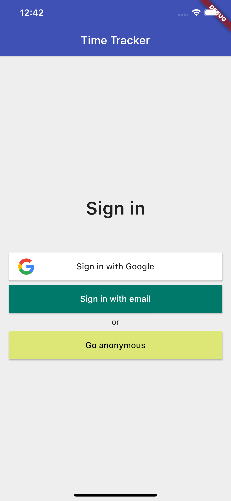
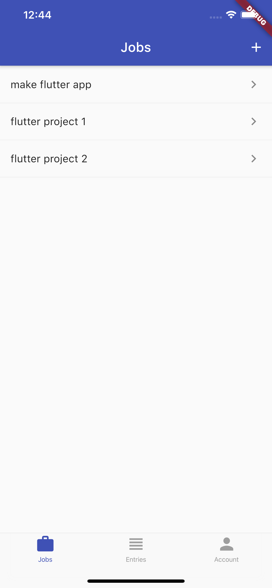
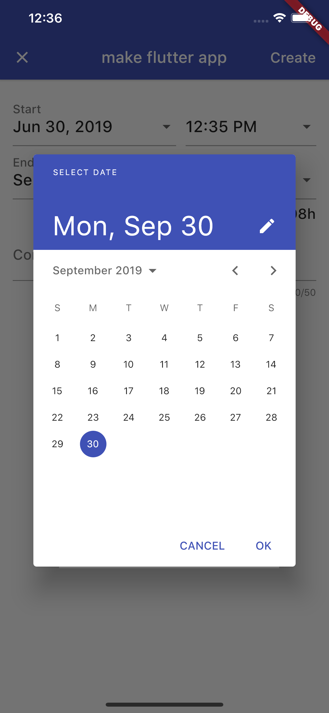
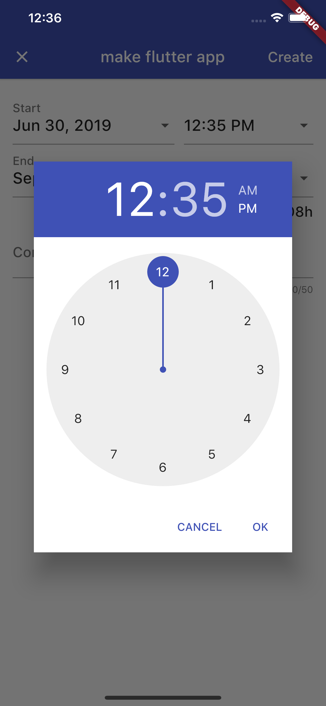
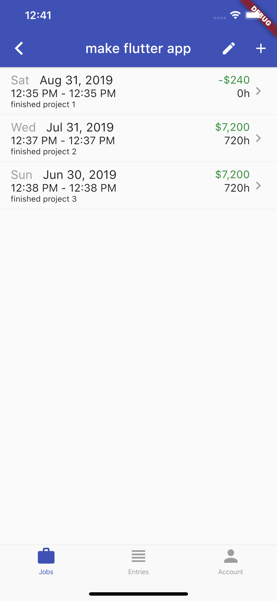
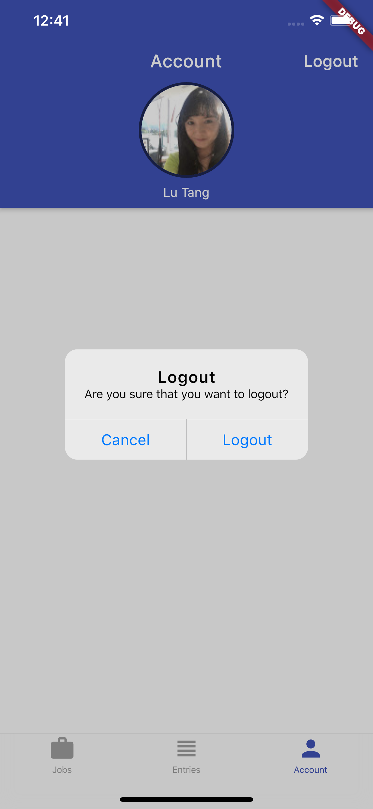

# timetracker

A flutter app that track time on each job with the related pay, including Firebase authentication on email sign in and google sign-in, cloud Firestore with NoSQL database , and using provide and Rx to manage state.

  
   
  
  
  
  

